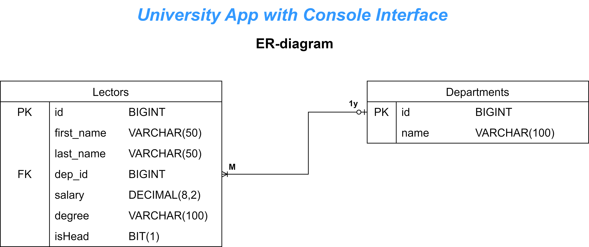
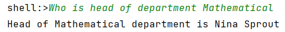
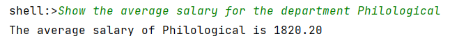
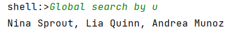

# University App with Console Interface

## The project uses Spring Shell to create console based interface.

The project supports the following console commands:

- `Who is head of department --depName` — Get a full name of a head of the department
- `Show the average salary for the department --depName` — Get the average salary in the specified department
- `Show count of employee for --depName` — Get the count of lectors in the specified department
- `Global search by --template` — Get full names of lectors whose names contain a particular subsequence
- `Show statistics --depName` — Shows the statistics about a department with a particular name

## 
ER-diagram for application entities

  

## Examples of command execution

- `Who is head of department Mathematical`

  

- `Show the average salary for the department Philological`

  

- `Global search by u`

  

